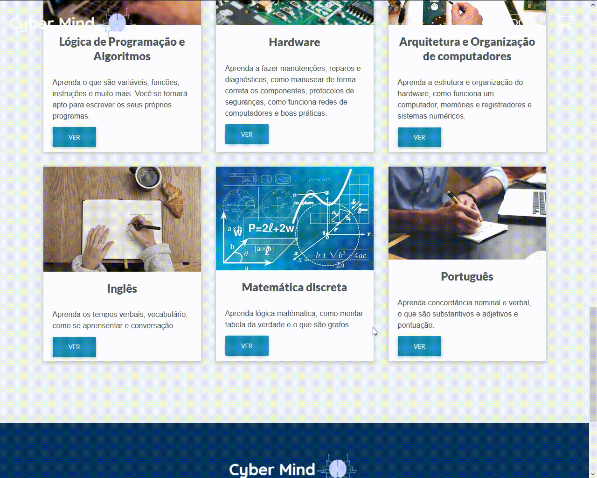
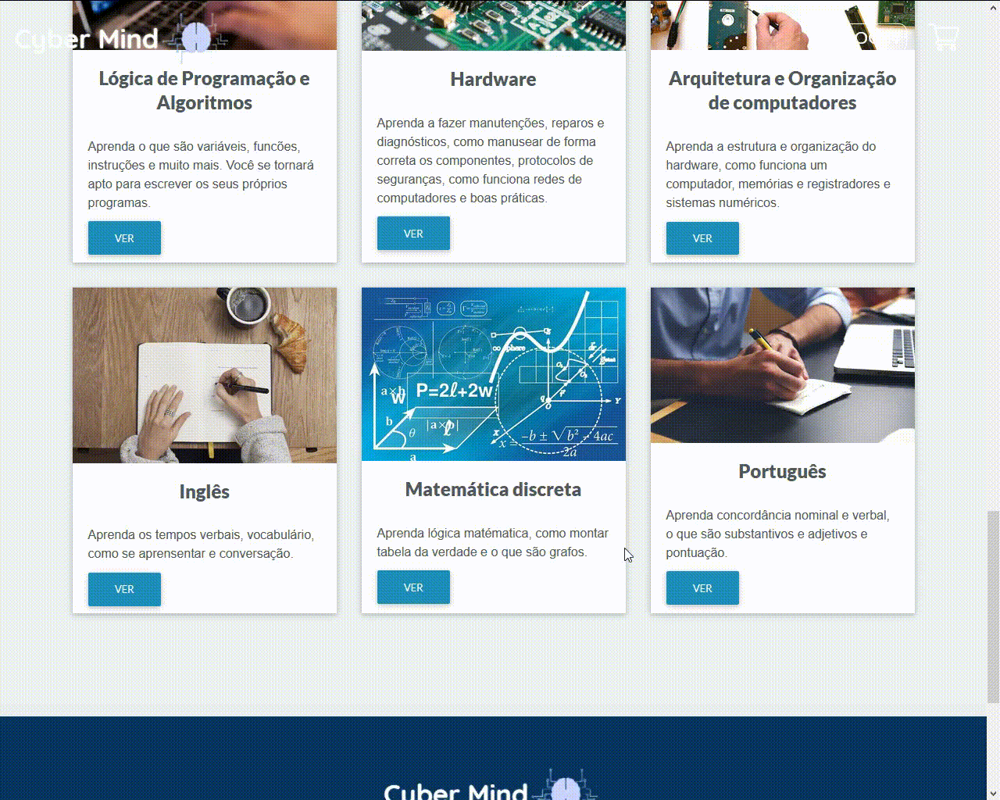
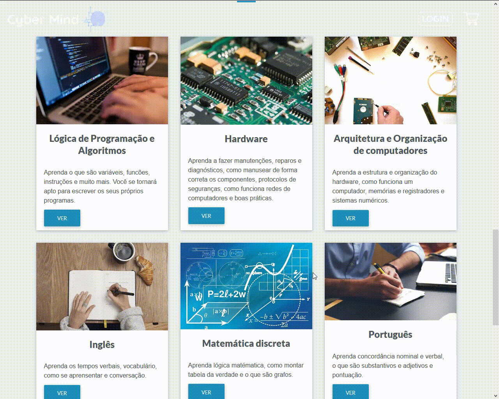
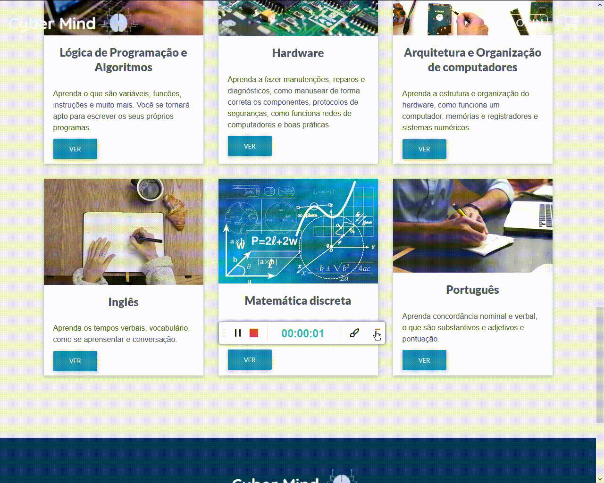
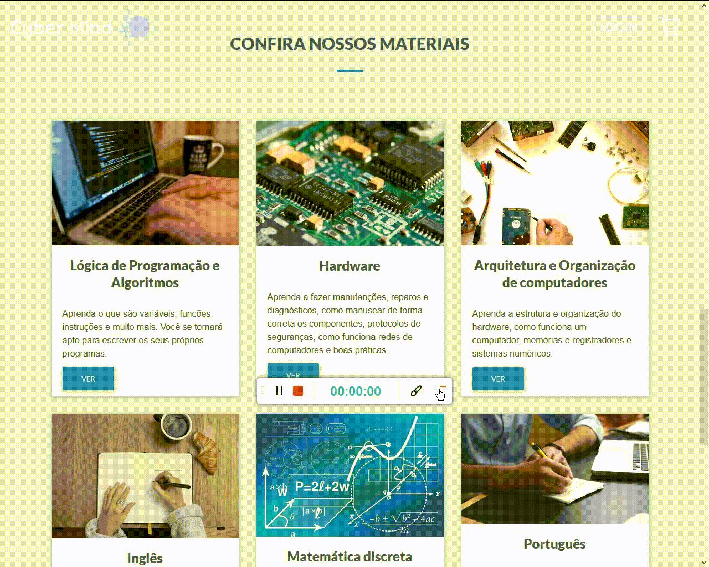
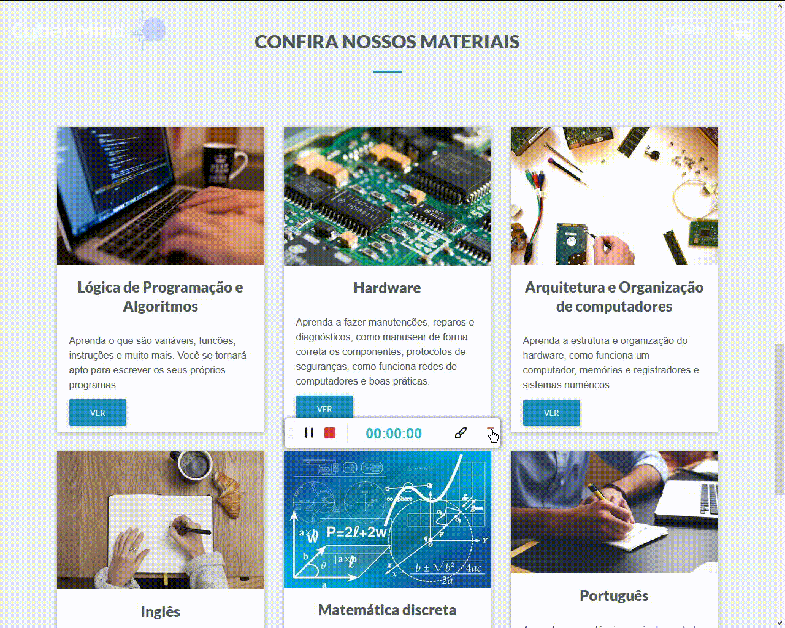

## <b>Demonstração do código:</b> :computer:

 

### Inglês

 

### Matemática Discreta

 

### Lógica de Programação e Algoritmos

 

### Português

 

### Arquitetura e Organização de Computadores

 

### Hardware

