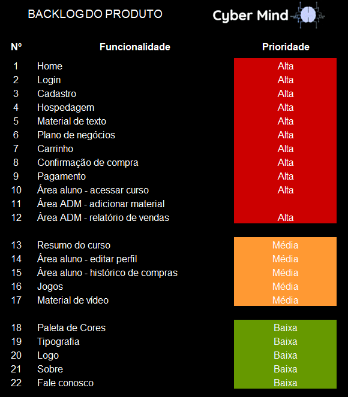
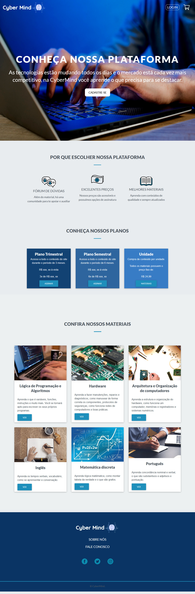

 

<h2 text align="center">Fatec Profº Jessen Vidal - São José dos Campos - 1º Semestre ADS</h2>

  
 

 
  
 
<h1 text align="center">CyberMind :brain::computer:</h1> 
<h2 text align="center">Conhecimento na palma da sua mão!</h2>

 

## - Objetivo do projeto -  
Desenvolver um site de e-commerce no qual os alunos possam acessar conteúdos didáticos de qualidade, fomentando a cultura e agregando valores ao cliente de acordo com as regras de negócios.

 

## - Descrição do projeto - 
O projeto têm como objetivo o desenvolvimento dos alunos de Análise e Desenvolvimento de Sistemas da Fatec de São José dos Campos - Profº Jessen Vidal, na criação de um site de venda de conteúdos didáticos voltado para a área da tecnologia. O trabalho visa a interação dos alunos com o cliente, no qual os mesmos possuem acesso as regras do projeto que são definidas pelo cliente, para assim atender suas demandas e necessidades.
 
 

## - Índice -

 [Sobre a plataforma](#ancora1)
 
 [Requisitos](#ancora2)
 
 [Equipe](#ancora3)
 
 [Ferramentas utilizadas](#ancora4)
 
 [Entregas](#ancora5)
 
 [Backlog do projeto](#ancora6)
 
 [Cronograma](#ancora7)
 
 [Site CyberMind](#ancora8)

 

## - Sobre a plataforma - 
O site desenvolvido têm como meta proporcionar a melhor experiência ao usuário, para que o aprendizado seja efetivo. Para isso, foram utilizadas técnicas de usuabilidade, assim como responsividade, para que independente do disposito pelo qual o site é acessado, a performance seja sempre a mesma. Além disso, optamos por um design minimalista e moderno, sendo azul e branco as cores predominantes, já que estão relacionadas a educação.  

 

## - Requisitos - :computer_mouse:  

O cliente solicitou que o site deverá possuir os seguintes requisitos:

<b>Materiais didáticos (texto, vídeo e jogo)</b> :

* Português (Concordância e Pontuação)

* Matemática (Lógica e Grafos)

* Inglês

* Hardware

* Arquitetura e Organização de Computadores

* Algoritmo e Lógica de Programação

 

<b>Funcionalidades:</b>

* Login e Esqueci senha

* Cadastro
* Carrinho de compras
* Área do administrador: Relatório de vendas
* Área do administrador: Adicionar Material

 

## - Equipe - :busts_in_silhouette:

* [Jean Gomes dos Santos (Scrum Master)](https://github.com/jeangomes3)

* [Ana Lívia Pascoal da Silva Araújo (Development Team)](https://github.com/arapujo/)

* [Diogo Luiz Troyli Pedrozo de Souza (Development Team)](https://github.com/diogotroyli)

* [Gabriele Gonçalves Vieira (Development Team)](https://github.com/GabrieleGVieira)

* [Kathlyn Talitiene Ribeiro Carvalho (Development Team)](https://github.com/arapujo/pi_primeiro_semestre)

* [Renato Hidalgo Santos (Development Team)](https://github.com/renatohidalgo23)

* [Sarah da Boa Viagem Santana (Development Team)](https://github.com/Sarah781)

* [Vitor Luiz Rodrigues de Lima (Development Team)](https://github.com/VilRL)

 

## - Ferramentas utilizadas - :hammer:

* Frontend: HTML5, CSS3, JavaScript e Bootstrap

* Backend: PHP e MySQL

 

## - Entregas - :white_check_mark:

- [x] Entrega 1 - 07/09/2020 à 27/09/2020 - Para visualizar a entrega, [clique aqui](https://github.com/arapujo/pi_primeiro_semestre/tree/master/SPRINT%200).

- [x] Entrega 2 - 28/09/2020 à 17/10/2020 - Para visualizar a entrega, [clique aqui](https://github.com/arapujo/pi_primeiro_semestre/tree/master/SPRINT%201).
- [ ] Entrega 3 - 19/10/2020 à 08/11/2020 - Em desenvolvimento...
- [ ] Entrega 4 - 09/11/2020 à 29/11/2020

 

## - Backlog do projeto - :bar_chart:

 

## - Cronograma - :clock1230:

 

## - Site Cybermind - :framed_picture:

Para ver o site em funciomanento até o momento, [clique aqui](http://cybermind.atwebpages.com/).

