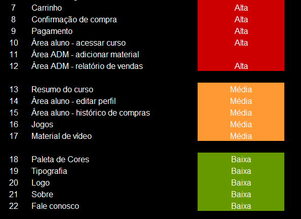
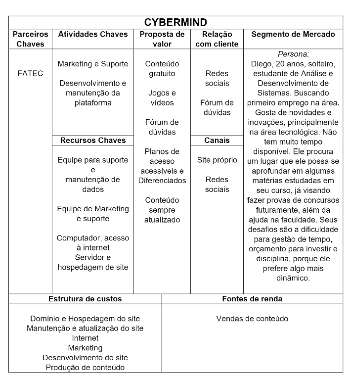

  
 
<h1 text align="center">CyberMind :brain::computer:</h1> 
<h2 text align="center">Conhecimento na palma da sua mão!</h2>

 

## Entrega Sprint 2

Os conteúdos entregue nessa sprint, foram definidos de acordo com as funcionalidades 7 até a 15 do nosso backlog, sendo desenvolvidas 9 features no total.

 

## Funcionalidades desenvolvidas
 

### Área Administrador

- [x] <b>Carrinho(confirmação de compra e pagamento) - (Layout)</b>  
:grey_exclamation:
Devido a complexidade do carrinho, ele foi divido em duas sprints. Na Sprint 2 - foram desenvolvidas o layout e parte da programação e na Sprint 3 - ele será integrado ao banco de dados e estará em pleno funcionamento. :grey_exclamation:

 

- [x] <b>Área Administrador - Adicionar material</b> - :white_check_mark: Completa :white_check_mark:

 

- [x] <b>Área Administador - Relatório de vendas(Layout)</b>  
:grey_exclamation: Esta funcionalidade depende das informações do Carrinho. Na sprint 2 - foi desenvolvido o layout e na Sprint 3 - será implementado o banco de dados.:grey_exclamation: 

 

### Área Aluno

- [x] <b>Área Aluno - Ver materiais</b>  
:grey_exclamation: Esta funcionalidade depende das informações do Carrinho. Na sprint 2 - foi desenvolvido o layout e na Sprint 3 - será implementado o banco de dados.:grey_exclamation:

 

- [x] <b>Área Aluno - Histórico de compras</b>
:grey_exclamation: Esta funcionalidade depende das informações do Carrinho. Na sprint 2 - foi desenvolvido o layout e na Sprint 3 - será implementado o banco de dados.:grey_exclamation: 

 

- [x] <b>Área Aluno - Ver perfil</b> - :white_check_mark: Completa :white_check_mark:

 

- [x] <b>Área Aluno - Ver material</b> 
:grey_exclamation: Esta funcionalidade depende das informações do Carrinho. Na sprint 2 - foi desenvolvido o layout e na Sprint 3 - será implementado o banco de dados.:grey_exclamation:

 

### Material

 

 
 

## - Índice -

 [Card da Sprint 2](#ancora1)
 
 [Materiais de texto](#ancora2)
 
 [Plano de negócios](#ancora3)
 
 [Site Cybermind](#ancora4)
 
  

## Card SPRINT 2 

No nosso cronograma (19/10/2020 à 08/11/2020) foi estabelecido a produção de:

* Tela Home

* Tela Login

* Tela Cadastro

* Materiais de Texto

* Plano de negócios

* Hospedagem

 

## - Materiais de texto -
Para conferir os <b>materiais de textos</b> produzidos, [clique aqui](https://github.com/arapujo/pi_primeiro_semestre/tree/master/SPRINT%201/Materiais%20Did%C3%A1ticos). Os arquivos estão em formato PDF e serão adicionados posteriormente ao site.

- [x] Lógica de Programação e Algoritmos

- [x] Hardware

- [x] Matemática (Lógica e Grafos)

- [x] Arquitetura e Organização de Computadores

- [x] Português (Concordância e Pontuação)

- [x] Inglês
 

## - Plano de negócios -
Para acessar nosso <b>Plano de Negócios</b> completo, [clique aqui.](https://github.com/arapujo/pi_primeiro_semestre/blob/master/SPRINT%201/Materiais%20Did%C3%A1ticos/Plano%20de%20Neg%C3%B3cios.pdf)

 
 

## - Site -
Site não está hospedado. Disponível somente em localhost.

Funcionalidades em funcionamento:

- [x] Home
 
- [x] Cadastro

- [x] Login

 :heavy_exclamation_mark: Durante o desenvolvimento do site, a hospedagem é gratuita. :heavy_exclamation_mark: 

 
 
 
 
