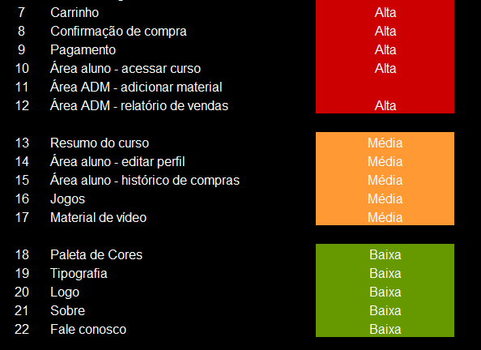
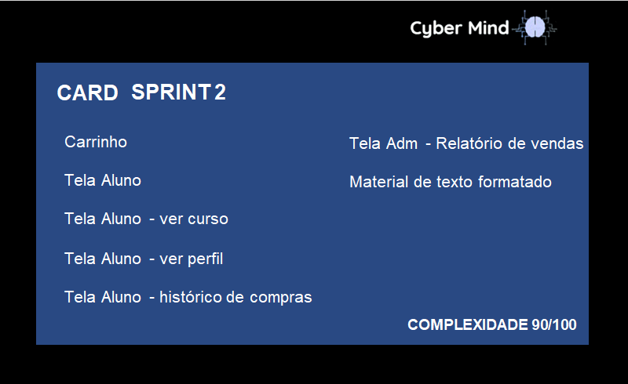
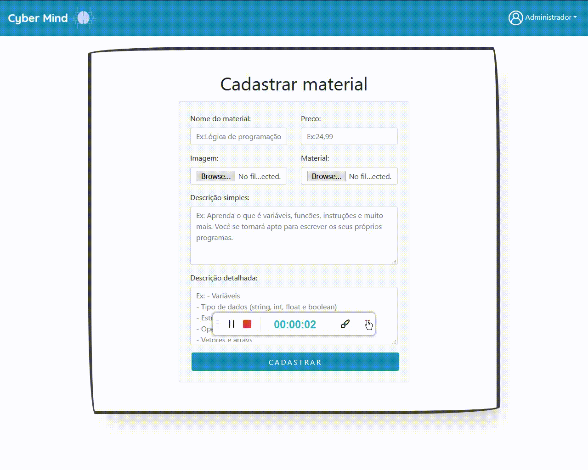

  
 
<h1 text align="center">CyberMind :brain::computer:</h1> 
<h2 text align="center">Conhecimento na palma da sua mão!</h2>

 

## Entrega Sprint 2

Os conteúdos entregue nessa sprint, foram definidos de acordo com as funcionalidades 7 até a 15 do nosso backlog, sendo desenvolvidas 9 features no total.

 
 

## - Índice -

 [Card da Sprint 2](#ancora1)
 
 [Funcionalidades desenvolvidas](#ancora2)
 
 [Código](#ancora3)
 
 
  

## Card SPRINT 2 

No nosso cronograma (19/10/2020 à 08/11/2020) foi estabelecido a produção de:

* Carrinho (confirmação e pagamento)

* Área Administrador 

* Área Aluno 

* Formatação materiais de texto

 

## - Funcionalidades desenvolvidas -
 

### Carrinho :car:

- [x] <b>Carrinho(confirmação de compra e pagamento) - (Layout)</b>  
:grey_exclamation:
Devido a complexidade do carrinho, ele foi divido em duas sprints. Na Sprint 2 - foram desenvolvidas o layout e parte da programação e na Sprint 3 - ele será integrado ao banco de dados e estará em pleno funcionamento. :grey_exclamation:

 

 

### Área Administrador :man_in_tuxedo:

- [x] <b>Área Administrador - Adicionar material</b> - :white_check_mark: Completa :white_check_mark:

 

- [x] <b>Área Administador - Relatório de vendas(Layout)</b>  
:grey_exclamation: Esta funcionalidade depende das informações do Carrinho. Na sprint 2 - foi desenvolvido o layout e na Sprint 3 - será implementado o banco de dados.:grey_exclamation: 

 

### Área Aluno  :man_student:

- [x] <b>Área Aluno - lista de materiais comprado</b>  
:grey_exclamation: Esta funcionalidade depende das informações do Carrinho. Na sprint 2 - foi desenvolvido o layout e na Sprint 3 - será implementado o banco de dados.:grey_exclamation:

 

- [x] <b>Área Aluno - Histórico de compras</b>
:grey_exclamation: Esta funcionalidade depende das informações do Carrinho. Na sprint 2 - foi desenvolvido o layout e na Sprint 3 - será implementado o banco de dados.:grey_exclamation:

 

- [x] <b>Área Aluno - Ver perfil</b> - :white_check_mark: Completa :white_check_mark:

 

- [x] <b>Área Aluno - Ver material</b> 
:grey_exclamation: Esta funcionalidade depende das informações do Carrinho. Na sprint 2 - foi desenvolvido o layout e na Sprint 3 - será implementado o banco de dados.:grey_exclamation:

 

### Material :closed_book:

- [x] <b>Página - Material </b> :white_check_mark: Completa :white_check_mark: -

   
    #### <b>Matemática discreta</b>
   
   
    
   
   ####  <b>Hardware</b>
    
     
    
   
   
    Arquitetura e organização de computadores</b>
   
    
   
    
    
      
   
   ####  <b>Inglês</b>
   
     
   
    
     
   
- [x] <b>Formatação material de texto - </b> :white_check_mark: Completa :white_check_mark: - Para visualizar, [clique aqui](https://github.com/arapujo/pi_primeiro_semestre/tree/master/SPRINT%202/MATERIAL)

  - [x] Português
  - [x] Matemática discreta
  - [x] Algoritmo e lógica de programação
  - [x] Hardware
  - [x] Arquitetura e organização de computadores
  - [x] Inglês

 

## - Código - :computer:

 - [x] Home - Para visualizar, [clique aqui](https://github.com/arapujo/pi_primeiro_semestre/tree/master/SPRINT%202/CODIGO).
 
 - [x] Área aluno - Para visualizar, [clique aqui](https://github.com/arapujo/pi_primeiro_semestre/tree/master/SPRINT%202/CODIGO/pages/aluno).
 - [x] Área Administrador - Para visualizar, [clique aqui](https://github.com/arapujo/pi_primeiro_semestre/tree/master/SPRINT%202/CODIGO/pages/admin).
 - [x] Carrinho - Para visualizar, [clique aqui](https://github.com/arapujo/pi_primeiro_semestre/tree/master/SPRINT%202/CODIGO/pages/carrinho).
 - [x] Área material - Para visualizar, [clique aqui](https://github.com/arapujo/pi_primeiro_semestre/tree/master/SPRINT%202/CODIGO).
  

 
 
