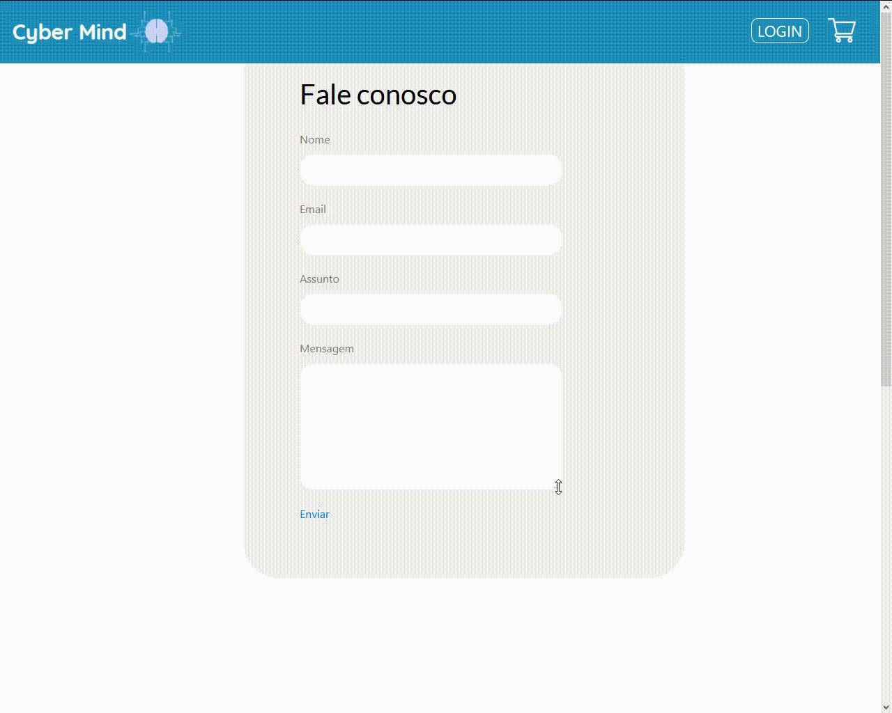
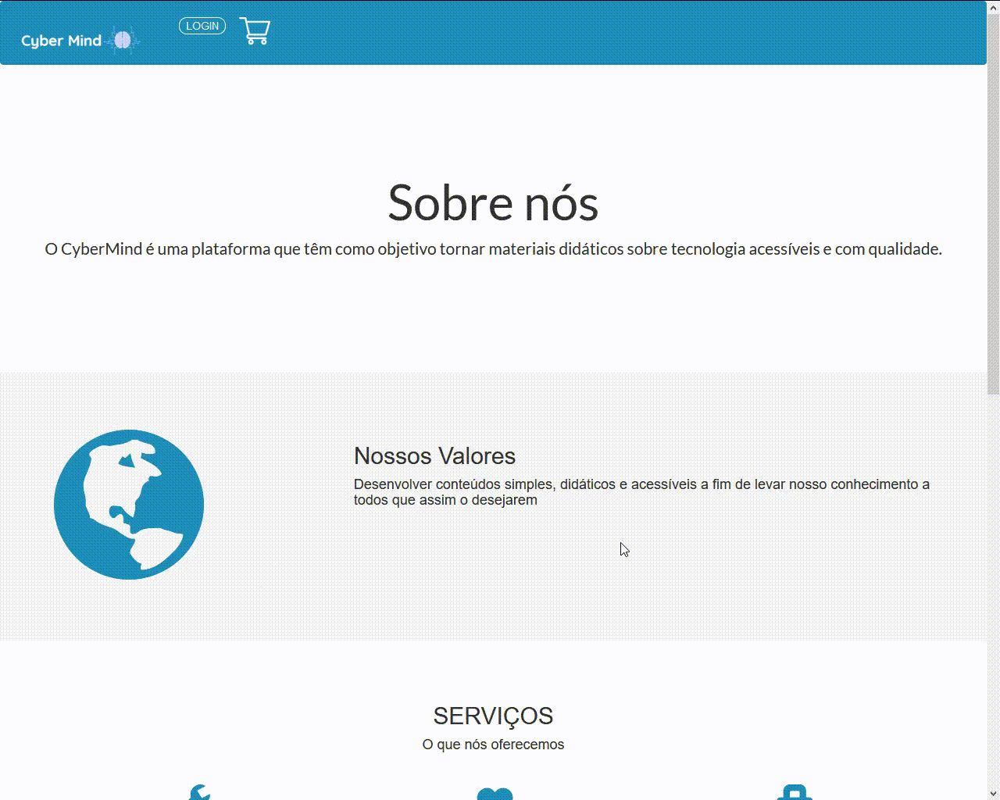

  
 
<h1 text align="center">CyberMind :brain::computer:</h1> 
<h2 text align="center">Conhecimento na palma da sua mão!</h2>

 

## Entrega Sprint 3

 
Foi definido como objetivo para a Sprint 3, a entrega final do produto para o cliente. Para isso, nossa equipe desenvolveu as funcionalidades restantes de nosso backlog.

 

 

## - Funcionalidades desenvolvidas -

 [Home](#ancora1)
 
 [Fale conosco](#ancora2)
 
 [Sobre nós](#ancora3)
 
 [Cadastro](#ancora4)
 
 [Login](#ancora5)
 
 [Carrinho](#ancora6)
 
 [Plano de acesso](#ancora7)
 
 [Área aluno](#ancora8)
 
 [Área aluno - Ver materiais](#ancora9)
 
 [Área aluno - Visualizar perfil](#ancora10)
 
 [Área aluno - Materiais de jogos](#ancora11)

 [Área aluno - Materiais de texto](#ancora12)
 
 [Área aluno - Materiais de vídeo](#ancora13)
 
 [Área Administrador - Cadastrar materiais](#ancora14)
 
 [Área Administrador - Relatório de vendas](#ancora15)
  
 [Área Administrador - Materiais cadastrados](#ancora16)

 

## - Materiais de vídeo -

 

### Quiz Hardware

 
 
 

### Quiz Algoritmos e Lógica de Programação

 
 
 

### Quiz Inglês

 
 
 

### Quiz Matemática Discreta

 
 
 

### Quiz Português

 
 
 

### Quiz Arquitetura e Organização de Computadores

 
 
 

## - Materiais de jogos -

 

## - Demonstração do site -

 

#### Home

  
  
  
Por meio da Home, o usuário terá acesso ao Login e Cadastro, ao carrinho e catálogo de materiais. O administrador possui um botão de login especial.

  
   
  
  
  #### Fale Conosco

  
  
  
Através desta página, o usuário poderá entrar em contato com a plataforma, para sugestões ou dúvidas, que serão enviadas para o email do Cybermind e analisadas posteriormente pela equipe de manutenção.

  
   

#### Sobre nós

 
 
 
 Breve descrição sobre o objetivo do Cybermind.

 
  
 
 
#### Cadastro

  
  
  
O usuário poderá fazer o cadastro, que contém verificação de correspondência de senha e email cadastrado.

  
    
   
   
   #### Login

  
  
  
Após o cadastro, o usuário poderá fazer o login e acessar todos os recursos do site.

  
    
   
   
 #### Carrinho

 
 
 
Por meio do catálogo de materiais, o usuário poderá comprar os conteúdos, adicionando ou removendo itens. Depois o usuário é redirecionado para a identificação, pagamento e posteriormente a confirmação da compra.

  
 
 
#### Plano de acesso

O usuário poderá optar por fazer uma assinatura mensal durante o período de 3 ou 6 meses. Durante esse tempo, o usuário terá acesso a todo material (texto e vídeo) do site.

 
  
 
 
 #### Área aluno

Após o login, o usuário terá a acesso a tela do Aluno, que possui jogos e catálogo de materiais e as opções de Visualizar perfil, materiais e Logout.

 

 #### Área aluno - Ver materiais

O usário terá acesso ao todos os materiais comprados por ele, por meio da página Ver Materiais.

 

#### Área aluno - Visualizar perfil

O usário poderá alterar informações cadastradas como nome ou senha e fornecer informações adicionais.

 

#### Área aluno - Material de jogo

O usário poderá realizar quizzes relacionados as matérias  de Portugûes, Inglês, Lógica, Matemática, Hardware, Lógica de Programação e Organização de Computadores. 

 

#### Área aluno - Material de texto

Página dos materiais do tipo texto. 

 

#### Área aluno - Material de vídeo

Página dos materiais do tipo texto. 

 

#### Área Administrador

Através de um login especial, o administrador terá acesso a área ADMIN. Nela, ele poderá cadastrar materiais, ver relatório de vendas e acompanhar materiais cadastrados.

 

#### Área Administrador - Relatório de vendas

O administrador poderá acompanhar todas as vendas (mensal, anual e saldo atual) e exportar o relatório.

 

#### Área Administrador - Materiais cadastrados

O administrador poderá acompanhar todos os materiais (vídeo, texto e jogo) cadastrados no site.

 

 
 
